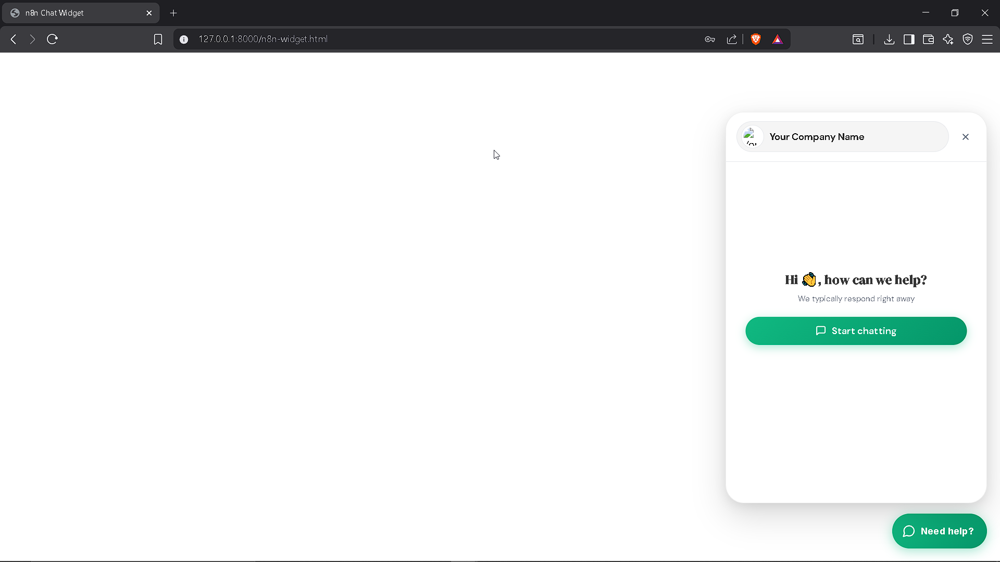
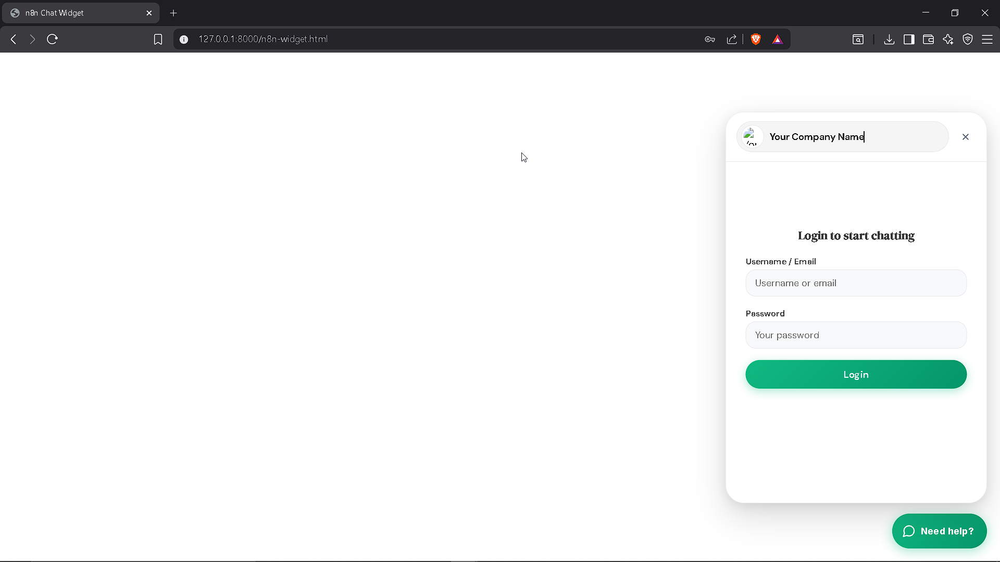
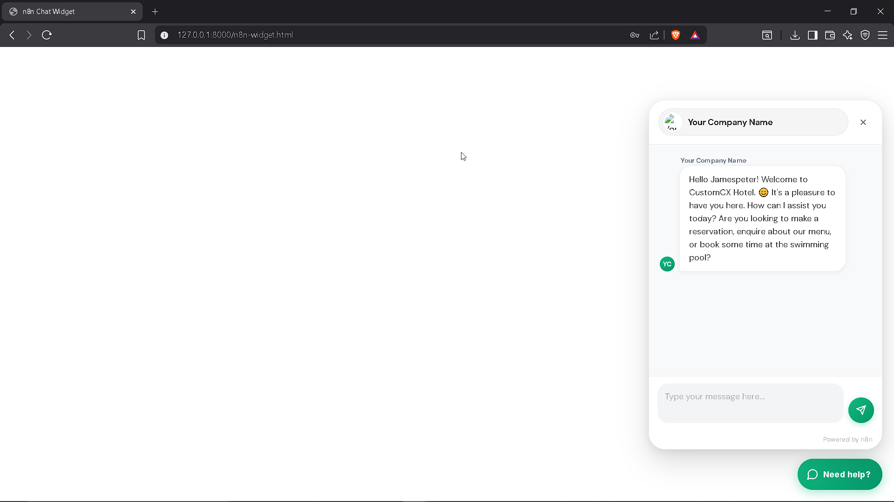

# n8n Chat Widget

A customizable, lightweight chat widget for integrating n8n workflows into your website. Enable AI-powered conversations directly on your web pages with minimal setup.

## Demo

### Live Demo Video
[Watch Demo](./resources/authentication.mp4)

### Hello Page / Company Header


### Authentication Page


### Chat Interface


## Features

- **Easy Integration** - Works with vanilla HTML, Vue.js, React, and more
- **Fully Customizable** - Branding, colors, positioning, and messaging
- **CDN Ready** - No build process required for simple integrations
- **n8n Powered** - Leverage n8n workflows for chat intelligence
- **Production Ready** - Lightweight and performant

## Prerequisites

Before using this chat widget, you'll need:

- **n8n Instance** - A running n8n server (cloud or self-hosted)
- **Webhook URL** - Your n8n webhook URL for chat interactions
- **Modern Browser** - Modern JavaScript support (ES2015+)

## Installation

### Step 1: Prepare Your n8n Workflow

1. Log in to your n8n instance
2. Import the included JSON workflow file or create your own chat workflow
3. Create a webhook endpoint in your n8n workflow to receive chat messages
4. Copy your webhook URL (you'll use this in the widget configuration)

### Step 2: Set Up the Widget

Choose your integration method below and follow the appropriate instructions.

## Usage

### HTML/CDN Integration

The simplest way to add the chat widget to any HTML page:

```html
<!DOCTYPE html>
<html lang="en">
<head>
    <meta charset="UTF-8" />
    <meta name="viewport" content="width=device-width, initial-scale=1.0" />
    <title>My Website</title>
    
    <!-- Chat Widget Styles -->
    <link href="https://cdn.jsdelivr.net/npm/@n8n/chat/dist/style.css" rel="stylesheet" />
</head>
<body>
    <h1>Welcome to My Website</h1>
    <p>Your content here...</p>

    <!-- Chat Widget Script -->
    <script type="module">
        import { createChat } from 'https://cdn.jsdelivr.net/npm/@n8n/chat/dist/chat.bundle.es.js';

        createChat({
            webhookUrl: 'YOUR_PRODUCTION_WEBHOOK_URL'
        });
    </script>
</body>
</html>
```

### Vue.js Integration

For Vue.js projects, import the widget in your component:

```vue
<!-- App.vue -->
<script lang="ts" setup>
import { onMounted } from 'vue';
import '@n8n/chat/style.css';
import { createChat } from '@n8n/chat';

onMounted(() => {
    createChat({
        webhookUrl: 'YOUR_PRODUCTION_WEBHOOK_URL'
    });
});
</script>

<template>
    <div>
        <!-- Your component content -->
    </div>
</template>
```

### React Integration

For React projects, use the `useEffect` hook to initialize the widget:

```tsx
// App.tsx
import { useEffect } from 'react';
import '@n8n/chat/style.css';
import { createChat } from '@n8n/chat';

export const App = () => {
    useEffect(() => {
        createChat({
            webhookUrl: 'YOUR_PRODUCTION_WEBHOOK_URL'
        });
    }, []);

    return (
        <div>
            {/* Your component content */}
        </div>
    );
};
```

## Configuration

The widget accepts a configuration object with the following options:

```javascript
createChat({
    // Required
    webhookUrl: 'YOUR_PRODUCTION_WEBHOOK_URL',
    
    // Optional: Branding
    branding: {
        logo: 'YOUR_LOGO_URL',           // Company/brand logo
        name: 'Your Company Name',        // Display name
        welcomeText: 'Hi, how can we help?',  // Initial greeting
        responseTimeText: 'We typically respond right away'  // Status message
    },
    
    // Optional: Styling
    style: {
        primaryColor: '#854fff',          // Primary action color
        secondaryColor: '#6b3fd4',        // Secondary color
        position: 'right',                // Widget position: 'left' or 'right'
        backgroundColor: '#ffffff',       // Chat window background
        fontColor: '#333333'              // Text color
    }
});
```

### Example Configuration

```html
<script>
    window.ChatWidgetConfig = {
        webhook: {
            url: 'https://your-n8n-instance.com/webhook/YOUR_WEBHOOK_ID/chat',
            route: 'general'
        },
        branding: {
            logo: 'https://example.com/logo.png',
            name: 'Customer Support',
            welcomeText: 'Hi, how can we help?',
            responseTimeText: 'We typically respond right away'
        },
        style: {
            primaryColor: '#854fff',
            secondaryColor: '#6b3fd4',
            position: 'right',
            backgroundColor: '#ffffff',
            fontColor: '#333333'
        }
    };
</script>
<script src="./widget-hosted.js"></script>
```

## File Structure

- **README.md** - This file; documentation and setup instructions
- **n8n-widget.html** - Standalone HTML example with full configuration
- **widget-hosted.js** - Chat widget JavaScript implementation
- **chat widget json file** - n8n workflow JSON for import
